# AyuRith (IP-SHAKTI Sahayak)
### AI-Powered Statutory Due Diligence & Patent Intelligence Platform for Ayurveda & Botanical Medicine

[](https://www.python.org/)
[](https://fastapi.tiangolo.com/)
[-black.svg)](https://nextjs.org/)
[](https://www.trychroma.com/)
[](LICENSE)

---

## Executive Overview

**AyuRith (IP-SHAKTI Sahayak)** is an evidence-grounded intellectual property (IP), regulatory compliance, and statutory due diligence platform designed specifically for the Ayurvedic, Siddha, Unani (ASU), and botanical therapeutics sector.

Navigating herbal and traditional medicine innovation in India requires reconciling three intersecting, often conflicting legal frameworks:
1. **The Patents Act, 1970**: Overcoming severe statutory barriers including **Section 3(p)** (Traditional Knowledge exclusion), **Section 3(e)** (Mere admixture without synergistic technical advancement), **Section 3(d)** (Enhanced therapeutic efficacy threshold under *Novartis AG v. Union of India*), and **Section 3(i)** (Prohibition of methods of medicinal treatment).
2. **Drugs and Cosmetics Act, 1940 & Rules, 1945**: Categorization under **Rule 158B** (Classical ASU Form 25-D Safe Harbor vs. Proprietary ASU Form 25-E vs. Phytopharmaceutical Drug under CDSCO).
3. **The Biological Diversity Act, 2002 & 2023 Amendment**: Mandatory **Section 6** prior approval of the **National Biodiversity Authority (NBA)** before patent grant, Access and Benefit Sharing (**ABS Regulation 9**) fee obligations, and State Biodiversity Board (**SBB**) intimations.

AyuRith eliminates legal guesswork by combining **deterministic statutory retrieval (RAG)**, **54 First Schedule Classical Treatises verification**, **quantitative patentability scoring**, **Chou-Talalay synergism calculation**, and **automated statutory filing dossiers**.

---

## System Architecture

```mermaid
graph TD
    User([Innovator / Patent Agent / AYUSH Manufacturer])
    
    subgraph Frontend ["Next.js 15 App Router (Frontend)"]
        UI_Home["Institutional Portal & Console"]
        UI_Classifier["5-Step Rule 158B Classifier"]
        UI_Treatises["54 Classical Treatises Explorer"]
        UI_Synergy["Chou-Talalay Synergy Engine"]
        UI_Patentability["Patentability Scorer (PPI)"]
        UI_NBA["NBA Form III & ABS Calculator"]
        UI_Compare["Polyherbal Diff Engine"]
        UI_Dossier["5-Pillar Due Diligence Dossier"]
        UI_Chat["Bilingual RAG Legal Assistant"]
        UI_Sources["Statutory Corpus & Chunk Viewer"]
    end

    subgraph Backend ["FastAPI Core (Backend REST API)"]
        Router_Health["/api/health"]
        Router_Classify["/api/classify"]
        Router_Treatises["/api/treatises"]
        Router_Synergy["/api/synergy"]
        Router_Patent["/api/patentability"]
        Router_NBA["/api/nba"]
        Router_Compare["/api/compare"]
        Router_Dossier["/api/dossier"]
        Router_Chat["/api/chat"]
        Router_Sources["/api/sources"]
    end

    subgraph Intelligence ["Statutory Engines & Knowledge Bases"]
        Engine_RAG["Grounded RAG Pipeline & Abstention Gate"]
        Engine_ChouTalalay["Chou-Talalay CI & DRI Algorithms"]
        Engine_PPI["Patentability Probability Index Scorer"]
        Engine_ABS["Regulation 9 ABS Tier Engine"]
        Engine_Diff["Stoichiometric Concordance Matrix"]
    end

    subgraph Storage ["Persistent Data Layer"]
        ChromaDB[("ChromaDB Vector Store\n(Acts, Treatises, Case Precedents)")]
        SQLite[("SQLite Database\n(Audit Trails, Sources, Sessions)")]
        GeminiLLM["Google Gemini GenAI\n(gemini-2.5-flash / gemini-3)"]
    end

    User --> Frontend
    Frontend --> Backend
    Backend --> Intelligence
    Intelligence --> Storage
    Storage --> GeminiLLM
```



---

## Core Modules & Capabilities

### 1. Prior-Art Patent Landscape & Patentability Probability Scorer (`/patentability`)
- **Patentability Probability Index (PPI, 0–100)**: Quantitative scoring of Novelty (§ 2(1)(j)), Inventive Step (§ 2(1)(ja)), Industrial Applicability, and Section 3 Statutory Clearance.
- **Section 3 Exclusion Audit**: Detailed risk analysis across § 3(p) (TKDL prior art), § 3(e) (admixture), § 3(d) (enhanced efficacy), and § 3(i) (method of treatment conversion).
- **Cross-Office Prior-Art Landscape**: Anticipated claim citations comparing against IPO, USPTO, EPO, and TKDL (CSIR).
- **Statutory Claim Restructuring**: Generates IPO-compliant independent product claims and standardized HPLC-tolerance dependent claims with one-click copy.
- **Curated Benchmarks**: *Nano-Liposomal Curcumin*, *Synergistic Withania + Bacopa*, *Classical Trikatu Capsule*, and *Supercritical Boswellia Extract*.

### 2. National Biodiversity Authority (NBA) Section 6 & ABS Assistant (`/nba`)
- **Access & Benefit Sharing (ABS) Calculator**: Computes annual ABS fee liability under Regulation 9 of Guidelines on Access to Biological Resources (0.1% for < ₹1 Cr, 0.2% for ₹1–3 Cr, 0.5% for > ₹3 Cr ex-factory turnover, or 2–3% on patent royalties).
- **Fund Distribution**: Models statutory 95% allocation to local Biodiversity Management Committees (BMCs) and 5% to the National Biodiversity Fund.
- **Form III Statutory Dossier Builder**: Compiles full prior-approval application under Section 6 of Biological Diversity Act, 2002 before patent grant.
- **Section 55 Penal Liability Audit**: Evaluates civil penalties and patent revocation exposure under Section 64(1)(p) of The Patents Act.

### 3. Polyherbal Formulation Comparative Diff Engine (`/compare`)
- **Multi-Formulation Comparison**: Compares 2 or 3 formulations side-by-side (Classical Treatise vs. Commercial ASU Brand vs. Patented NDDS).
- **Ingredient Concordance Matrix**: Cross-analyzes universal core herbs, shared components, and unique novel substitutions.
- **Biomarker Concentration & Stoichiometry Variance**: Identifies variations in active HPLC markers (e.g., Curcuminoids %, Withanolides %, Piperine %).
- **Regulatory Divergence Audit**: Highlights licensing pathways (Rule 158B Classical safe-harbor vs. Proprietary ASU vs. CDSCO Phytopharmaceutical Drug vs. Patent Route).

### 4. 54 Classical Treatises Explorer & Verification Simulator (`/treatises`)
- **Codified Directory**: Complete database of all 54 authoritative texts recognized in the First Schedule of the Drugs and Cosmetics Act, 1940 (Charaka Samhita, Sushruta Samhita, Ashtanga Hridaya, Sharangadhara Samhita, Bhavaprakasha, AFI, API).
- **Prior-Art Verification Simulator**: Cross-references botanical ingredients, therapeutic indications, and Sanskrit formulations against known TKDL shlokas to evaluate Section 3(p) revocation risk.

### 5. Section 3(e) Synergism & Chou-Talalay CI Evaluator (`/synergy`)
- **Mathematical Synergism**: Computes the Chou-Talalay Combination Index ($CI = \frac{D_1}{(D_x)_1} + \frac{D_2}{(D_x)_2}$):
  - $CI < 0.9$: Synergistic (Statutory compliance with Section 3(e)).
  - $0.9 \le CI \le 1.1$: Additive (High Section 3(e) mere admixture rejection risk).
  - $CI > 1.1$: Antagonistic.
- **Dose Reduction Index (DRI)**: Quantifies reduction in therapeutic dose permitted by synergistic interaction.
- **IPO Form 2 Claim Drafter**: Automated drafting of independent composition claims incorporating synergistic concentration bounds.

### 6. 5-Pillar IP Due Diligence Audit Dossier (`/dossier`)
- Generates comprehensive statutory audit reports covering:
  1. Section 3(p) TKDL Classical Prior Art Bar
  2. Section 3(e) Synergistic Technical Advancement
  3. Rule 158B Manufacturing Licensing Route (Form 25-D vs. Form 25-E)
  4. NBA Section 6 Form III & SBB Compliance Mandate
  5. Drugs & Magic Remedies (Objectionable Advertisements) Act, 1954 Prohibited Claims Audit
- One-click institutional print/PDF export.

### 7. Grounded Statutory RAG Legal Assistant (`/chat`)
- Multi-turn legal Q&A assistant grounded in the indexed statutory corpus.
- **Confidence Gate**: Cosine similarity cutoff ($\ge 0.20$) enforcing deterministic abstention rather than hallucinating legal citations.
- **Bilingual**: Native support for English and Hindi queries.

---

## Statutory Legal Framework Grounding

| Legislation / Regulatory Instrument | Key Sections / Rules | Application in AyuRith |
| :--- | :--- | :--- |
| **The Patents Act, 1970** | § 2(1)(j), § 2(1)(ja), § 3(d), § 3(e), § 3(p), § 3(i), § 64 | Patentability Probability Index, Synergy CI Gate, Claim Restructuring |
| **Drugs and Cosmetics Act, 1940** | Section 3(a), First Schedule | 54 Classical Treatises Directory, Prior-Art Search |
| **Drugs and Cosmetics Rules, 1945** | Rule 158B (Form 25-D & 25-E) | ASU Licensing Pathway Classifier, Clinical Trial Exemption Audit |
| **Biological Diversity Act, 2002 / 2023** | Section 3, Section 6, Section 7, Section 55 | Form III Patent Approval Dossier, Section 55 Penal Assessment |
| **ABS Regulations, 2014** | Regulation 9 | Tiered Access & Benefit Sharing Fee Calculator |
| **Drugs & Magic Remedies Act, 1954** | Section 3, Schedule | Advertising Claim Flagging (Prohibited Disease Cures) |
| **New Drugs and Clinical Trials Rules, 2019** | Chapter IV-A | Phytopharmaceutical Drug Development Pathway |

---

## Technology Stack

- **Frontend**:
  - Framework: [Next.js 15](https://nextjs.org/) (App Router, Turbopack)
  - Core: React 19, TypeScript
  - Styling: Vanilla Tailwind CSS (v4), DaisyUI, Lucide React
  - Design Philosophy: Archival parchment and vegetable-ink institutional palette (`#faf8f4`, `#144226`, `#7a5a19`), zero emojis, typography-driven clarity.
- **Backend**:
  - Framework: [FastAPI](https://fastapi.tiangolo.com/) (Asynchronous Python REST API)
  - Runtime: Python 3.11+
  - Vector Storage: [ChromaDB](https://www.trychroma.com/) (Persistent embeddings storage)
  - Relational Database: SQLite via SQLAlchemy (Audit records, chat sessions, sources metadata)
  - GenAI: Google GenAI SDK (`gemini-2.5-flash` / `gemini-3-flash-preview`) with fallback parsing.

---

## Repository Structure

```text
AyuRith/
├── backend/
│   ├── app/
│   │   ├── api/
│   │   │   ├── chat.py             # Grounded RAG legal assistant endpoint
│   │   │   ├── classify.py         # 5-step Rule 158B classifier
│   │   │   ├── compare.py          # Polyherbal formulation diff engine
│   │   │   ├── dossier.py          # 5-pillar due diligence dossier generator
│   │   │   ├── health.py           # Healthcheck and system telemetry
│   │   │   ├── ingest.py           # Statutory PDF/text ingestion
│   │   │   ├── nba.py              # NBA Section 6 Form III & ABS calculator
│   │   │   ├── patentability.py    # Patentability Probability Index (PPI) scorer
│   │   │   ├── sources.py          # Corpus management and chunk inspection
│   │   │   ├── synergy.py          # Chou-Talalay CI & patent claim drafter
│   │   │   └── treatises.py        # 54 Classical Treatises directory
│   │   ├── models/
│   │   │   └── database.py         # SQLAlchemy SQLite schemas & session management
│   │   ├── services/
│   │   │   ├── abstention.py       # Deterministic abstention rules
│   │   │   ├── classifier.py       # Decision-tree ASU classification logic
│   │   │   ├── confidence.py       # Scoring calibration & threshold evaluation
│   │   │   ├── ingestion.py        # ChromaDB vector initialization & chunking
│   │   │   ├── llm.py              # Gemini client with exponential backoff
│   │   │   ├── rag.py              # Retrieval-augmented generation pipeline
│   │   │   ├── retrieval.py        # Multi-collection vector queries
│   │   │   └── translation.py      # Language detection & translation
│   │   ├── config.py               # Environment configuration
│   │   └── main.py                 # FastAPI application factory & router registration
│   ├── data/                       # Persistent vector database storage
│   ├── requirements.txt            # Python dependencies
│   └── .env.example                # Example environment configuration
├── frontend/
│   ├── app/
│   │   ├── chat/page.tsx           # Interactive legal assistant UI
│   │   ├── classifier/page.tsx     # 5-step classification wizard
│   │   ├── compare/page.tsx        # Formulation comparative diff UI
│   │   ├── dossier/page.tsx        # Due diligence dossier view & print
│   │   ├── nba/page.tsx            # NBA Form III & ABS calculator UI
│   │   ├── patentability/page.tsx  # Patentability probability scorer UI
│   │   ├── sources/page.tsx        # Vector corpus explorer UI
│   │   ├── synergy/page.tsx        # Chou-Talalay synergy calculator UI
│   │   ├── treatises/page.tsx      # 54 Classical Treatises directory UI
│   │   ├── Navbar.tsx              # Clean modular dropdown navigation
│   │   ├── layout.tsx              # Root layout & institutional theme
│   │   ├── page.tsx                # Homepage & statutory intelligence console
│   │   └── globals.css             # Theme tokens & typography configuration
│   ├── package.json                # Node.js dependencies
│   └── tsconfig.json               # TypeScript configuration
└── README.md                       # Project documentation
```

---

## Installation & Local Setup

### 1. Prerequisites
- **Python**: 3.11 or higher
- **Node.js**: 18.0 or higher
- **Git**

### 2. Clone the Repository
```bash
git clone https://github.com/AdarshGautam1/ayurith.git
cd ayurith
```

### 3. Backend Setup
```bash
cd backend

# Create and activate virtual environment
python -m venv venv

# On Windows:
.\venv\Scripts\activate
# On Linux/macOS:
source venv/bin/activate

# Install dependencies
pip install -r requirements.txt

# Configure environment variables
cp .env.example .env
# Edit .env and supply your GEMINI_API_KEY
```

Start the backend server:
```bash
python -m uvicorn app.main:app --host 127.0.0.1 --port 8000 --reload
```
The FastAPI documentation will be available at [http://127.0.0.1:8000/docs](http://127.0.0.1:8000/docs).

### 4. Frontend Setup
In a new terminal window:
```bash
cd frontend

# Install Node dependencies
npm install

# Run the Next.js development server
npm run dev
```
Open [http://localhost:3000](http://localhost:3000) in your browser.

---

## Verification & Type Safety

### TypeScript Verification
```bash
cd frontend
npx tsc --noEmit
```
*Expected output: 0 errors.*

### Backend Route Check
```bash
cd backend
python -c "from app.main import app; print([r.path for r in app.routes if 'api' in r.path])"
```

---

## Disclaimer

**AyuRith (IP-SHAKTI Sahayak)** is an informational decision-support and regulatory intelligence tool. It provides automated statutory analysis based on codified Indian legislation, judicial precedents, and authoritative texts. **It does not constitute formal legal counsel.** Prior to commercial filing, licensing, or litigation, users must consult a qualified Patent Agent, Advocate, or regulatory consultant.

---

## License

This project is licensed under the MIT License — see the [LICENSE](LICENSE) file for details.
